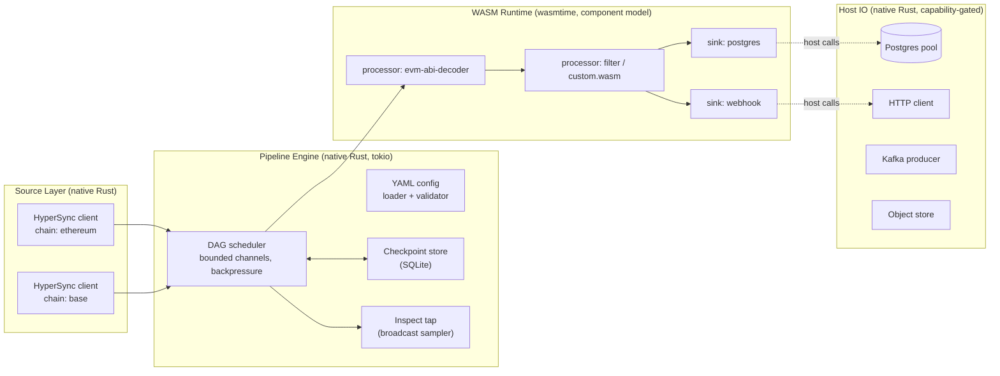
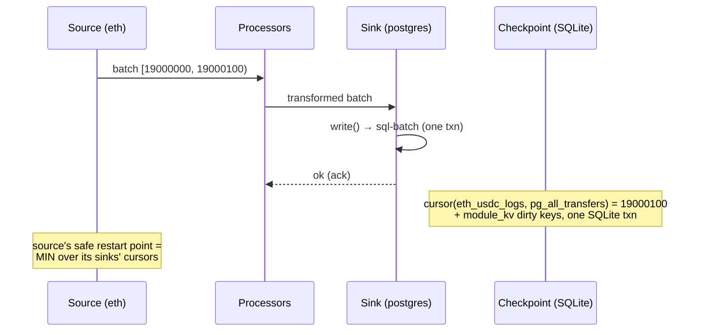

# HyperPipe — WASM Data Pipelines on HyperSync

> **Status:** Architecture spec v0.1 · 2026-07-02
> **Scope:** The system design and the rationale behind it. Section refs (§) in code and docs point here.
> **What it is:** Real-time + backfill blockchain data pipelines, built on **Envio HyperSync** as the ingestion layer, with **WASM modules** as the extensibility layer.

---

## 1. Product Overview

### 1.1 What it is

A single-binary pipeline engine. The user writes one YAML file that declares:

- **Sources** — one or more chains, each backed by HyperSync (logs / transactions / blocks / traces, filtered).
- **Processors** — an ordered DAG of WASM modules that decode (ABI), filter, reshape, and enrich records.
- **Sinks** — one or more WASM modules that deliver records to external systems (Postgres, webhook, Kafka, S3, ...).

The engine wires these together, streams data through, checkpoints progress, and recovers on restart with at-least-once delivery.

```
hyperpipe run pipeline.yaml
```

### 1.2 Design properties

- **Ingestion:** HyperSync — up to 2000x faster than RPC, 70+ EVM chains + Fuel; any other EVM chain via RPC fallback.
- **Backfill:** HyperSync's core strength; historical ranges stream in minutes.
- **Transforms:** any language that compiles to a WASM component (Rust today; TS via jco, Go, AssemblyScript target the same WIT) plus a built-in module library.
- **Sinks:** built-in set **+ user-supplied WASM sinks** — bring your own destination.
- **Extensibility:** an open module interface (WIT); every stage can be swapped or replaced.
- **Sandboxing:** capability-based — a module can only reach the hosts and connections the YAML grants it.
- **Deployment:** self-hosted single binary.
- **Delivery:** at-least-once, with idempotent sink support.
- **Startup:** sub-5s target via a precompiled WASM cache.

Current limitations: chains are those HyperSync serves (EVM + Fuel; no Solana/NEAR/Bitcoin/Stellar) and there are no SQL transforms.

### 1.3 Non-goals (for now)

- No hosted/multi-tenant control plane.
- No exactly-once semantics — at-least-once + idempotent sinks.
- No non-EVM chains beyond what HyperSync offers.
- No GUI. CLI + YAML only.

---

## 2. High-Level Architecture



**The rule that makes this work:** WASM modules do *compute only*. All network IO happens through host-provided import functions. The host owns connections, pooling, TLS, retries, and secrets. Modules receive capability handles, never credentials.

### 2.1 Process model

One OS process. Inside it:

- **One source task per source** (tokio task running the HyperSync streaming loop).
- **One worker pool per processor/sink stage** (N wasmtime instances of the same component, N from `resource_size`).
- **Bounded mpsc channels** between stages — backpressure propagates naturally to the source, which pauses its HyperSync query loop when downstream is full.
- **One checkpoint coordinator** tracking per-(source, sink) cursors.

---

## 3. Core Concepts & Data Model

### 3.1 Record envelope

Everything flowing between stages is a **batch**: an envelope + a list of records. Batches (not single records) cross the WASM boundary — this amortizes serialization and instance-call overhead and keeps the door open for vectorized (Arrow) execution later.

```jsonc
// Batch envelope — encoding v1 = JSON; CBOR and Arrow IPC reserved (§12)
{
  "schema": "hyperpipe/batch/v1",
  "batch_id": "eth_usdc_logs:19000000:19000100:0",  // deterministic: source:from:to:seq
  "source": "eth_usdc_logs",
  "chain_id": 1,
  "block_range": [19000000, 19000100],   // inclusive, exclusive — mirrors HyperSync
  "kind": "log",                          // log | transaction | block | trace | decoded | custom
  "records": [ /* kind-specific objects, see below */ ]
}
```

Record shapes for `log` / `transaction` / `block` / `trace` mirror HyperSync's field selection 1:1 (whatever fields the YAML `field_selection` requested are present; nothing else). The `decoded` kind is produced by the ABI decoder:

```jsonc
{
  "chain_id": 1,
  "block_number": 19000042,
  "block_hash": "0x...",
  "block_timestamp": 1719900000,
  "transaction_hash": "0x...",
  "log_index": 12,
  "address": "0xa0b8...eb48",
  "event": "Transfer",
  "signature": "Transfer(address,address,uint256)",
  "params": { "from": "0x...", "to": "0x...", "value": "1250000000" }  // uint256 as decimal string
}
```

**Numeric encoding rule:** all integers ≥ 2^53 are decimal strings in JSON encoding. Non-negotiable — silent float truncation is the classic pipeline bug.

### 3.2 Control records

Batches with `kind: "control"` flow through the same channels, in order:

- `{ "control": "rollback", "chain_id": 1, "invalidate_after_block": 19000050 }` — reorg (§5.2).
- `{ "control": "checkpoint", ... }` — internal barrier marker (engine-only, never enters WASM).
- `{ "control": "eof", "source": "..." }` — backfill source exhausted its range; lets job-mode pipelines terminate cleanly.

Processors pass control records through untouched by default (the SDK handles this); sinks may implement handlers (e.g. Postgres sink deletes rows on `rollback`).

### 3.3 DAG

- Nodes: sources, processors, sinks. Edges declared via each node's `inputs: [...]`.
- Sources have no inputs. Sinks have no consumers. Processors have both.
- Multiple inputs = merged stream (no ordering guarantee *across* sources; strict block order *within* one source).
- Fan-out is free: any node's output can feed many consumers; the engine clones batches (cheap — `Arc<Bytes>` until the WASM boundary).
- Cycles are a validation error.

---

## 4. YAML Configuration Spec

Full annotated example — this is also the demo pipeline:

```yaml
# pipeline.yaml
name: usdc-multichain
version: 1

runtime:
  resource_size: m                  # s | m | l — see sizing table §11
  checkpoint:
    store: sqlite                   # sqlite (default) | postgres
    path: ./state/usdc.db           # for postgres: connection: ${secret:CKPT_PG}

# ---------- SOURCES: N chains, each an independent HyperSync stream ----------
sources:
  - name: eth_usdc_logs
    type: hypersync
    chain: ethereum                 # named preset (chain registry) — or chain_id: 1, or url: https://...
    mode: live                      # live | backfill | both (backfill then follow head)
    from_block: 19000000            # omit => chain head (live) / 0 (backfill)
    # to_block: 19100000            # only valid in backfill mode
    confirmations: 10               # lag behind head; MVP reorg protection
    batch:
      max_records: 5000             # engine may deliver less, never more
      max_interval_ms: 500          # flush partial batch after this long (latency bound)
    query:                          # mirrors HyperSync query semantics 1:1
      logs:
        - address: ["0xA0b86991c6218b36c1d19D4a2e9Eb0cE3606eB48"]
          topics: [["0xddf252ad1be2c89b69c2b068fc378daa952ba7f163c4a11628f55a4df523b3ef"]]
      field_selection:
        log: [address, topic0, topic1, topic2, topic3, data, block_number, log_index, transaction_hash]
        block: [number, timestamp, hash]

  - name: base_usdc_logs
    type: hypersync
    chain: base
    mode: live
    confirmations: 10
    query:
      logs:
        - address: ["0x833589fCD6eDb6E08f4c7C32D4f71b54bdA02913"]
          topics: [["0xddf252ad1be2c89b69c2b068fc378daa952ba7f163c4a11628f55a4df523b3ef"]]
      field_selection:
        log: [address, topic0, topic1, topic2, topic3, data, block_number, log_index, transaction_hash]
        block: [number, timestamp, hash]

# ---------- PROCESSORS: ordered DAG of WASM modules ----------
processors:
  - name: decode
    module: builtin/evm-abi-decoder@1     # builtin/<name>@<major> — ships with the binary
    inputs: [eth_usdc_logs, base_usdc_logs]
    config:                                # opaque to engine; passed to module init() as JSON bytes
      abis:
        - file: ./abis/erc20.json
          events: [Transfer]               # decode only these; others dropped
      on_undecodable: drop                 # drop | passthrough | error

  - name: big_transfers
    module: builtin/filter@1
    inputs: [decode]
    config:
      expr: 'params.value >= "1000000000000"'   # built-in filter DSL (CEL subset), planned

  - name: enrich                            # user-supplied custom module
    module:
      file: ./modules/enrich.wasm           # local path; oci://... reserved
    inputs: [big_transfers]
    permissions:                            # capability grants — empty by default
      http: ["api.coingecko.com"]           # host allowlist for host-http
    config:
      price_feed: coingecko

# ---------- SINKS: N destinations, fan-out ----------
sinks:
  - name: pg_all_transfers
    module: builtin/postgres@1
    inputs: [decode]                        # gets EVERY decoded transfer, both chains
    connections: [pg_main]                  # host opens pool; module gets a handle, never creds
    config:
      connection: pg_main
      table: usdc_transfers
      mode: upsert                          # insert | upsert
      unique_key: [chain_id, block_number, log_index]
      create_table: true                    # DDL from first batch schema
      column_map:                           # optional renames; default = field names
        params.from: from_address
        params.to: to_address
        params.value: amount

  - name: whale_alerts
    module: builtin/webhook@1
    inputs: [enrich]                        # only enriched big transfers
    permissions:
      http: ["hooks.slack.com"]
    config:
      url: ${secret:SLACK_WEBHOOK}
      max_batch: 50
      retry: { attempts: 5, backoff_ms: 1000, max_backoff_ms: 30000 }

# ---------- CONNECTIONS & SECRETS ----------
connections:
  pg_main:
    type: postgres
    dsn: ${secret:PG_MAIN_DSN}              # resolved by host at startup, never enters WASM
    pool: { max: 8 }
  lake:                                      # object store for the s3 sink (§7.1)
    type: s3
    bucket: my-data-lake
    region: us-east-1
    prefix: usdc/                            # key prefix
    # endpoint: https://<accountid>.r2.cloudflarestorage.com   # R2/MinIO override
    # local_path: ./state/lake               # dev/test: write to a local dir instead of S3
    # credentials come from the host env (AWS_ACCESS_KEY_ID / AWS_SECRET_ACCESS_KEY / AWS_SESSION_TOKEN)
```

### 4.1 Validation rules (engine enforces at `apply`/`run` time, before any data flows)

1. DAG well-formed: no cycles, all `inputs` resolve, no orphan processors, ≥1 source, ≥1 sink.
2. Every `${secret:NAME}` resolvable (env var `HYPERPIPE_SECRET_<NAME>` or secret store — §9).
3. Every module loadable + interface-version compatible; `init(config)` dry-run must succeed.
4. `permissions` must cover what built-in modules need (e.g. postgres sink requires its `connection` listed) — fail fast with a clear message.
5. `backfill` mode requires `to_block`; `live` forbids it.
6. Unknown YAML keys are **errors**, not warnings (typo protection).

---

## 5. Source Layer — HyperSync

Native Rust, using the official `hypersync-client` crate. Not WASM — ingestion is our performance edge; do not put it behind a serialization boundary.

### 5.1 Streaming loop (per source)

```
cursor = restore_checkpoint() or from_block
loop:
  target = min(archive_height - confirmations, to_block?)
  if cursor > target: wait/poll for new height (live mode); or emit EOF (backfill)
  resp = hypersync.query({ from_block: cursor, ...yaml query })
  batches = split(resp, batch.max_records)      # tag with batch_id, block_range
  for b in batches: channel.send(b)             # blocks when downstream full = backpressure
  cursor = resp.next_block
```

Key behaviors:

- **HyperSync pagination**: responses return `next_block`; the loop is a simple cursor walk. HyperSync decides response sizing; we re-chunk to the YAML `batch.max_records`.
- **Concurrency**: sources are fully independent tasks — 10 chains = 10 parallel streams. Intra-source prefetch (pipelining the next HyperSync query while the current batch drains) is planned — the client's streaming API supports configurable concurrency.
- **`both` mode**: run backfill loop to (head at start − confirmations), then switch to live polling. One cursor, seamless.
- **Chain registry**: a built-in `chains.toml` mapping names → HyperSync URLs + chain_ids (ethereum, base, arbitrum, optimism, polygon, ...). `url:` override for anything else. `HYPERSYNC_BEARER_TOKEN` env for authenticated tiers.
- **Block metadata join**: when `field_selection.block` is present, HyperSync returns block data alongside logs; the source layer denormalizes (injects `block_timestamp`/`block_hash` into each log record) so downstream modules never join.

### 5.2 Reorg stance

Two independently configurable layers (both implemented):

- **Safe distance:** `confirmations: N` lag — the source never emits past `head - N`. Users who set N above the chain's reorg depth can turn tracking off (`reorg: { enabled: false }`) and need no rollback machinery at all. `confirmations: 0` + tracking off is rejected at validation.
- **Rollback tracking (`reorg: { enabled, window }`, default on, window 64):** the source keeps a bounded window of (block_number, block_hash) for emitted blocks — persisted via the checkpoint KV, so it survives restarts — and checks each response's HyperSync `rollback_guard` (`first_parent_hash` chain check + re-fetched block overlap) against it. On mismatch: locate the fork by re-fetching canonical hashes (`include_all_blocks` headers query), emit a `rollback` control record, rewind the cursor, and re-ingest. The checkpoint store write-through rewinds the durable cursor (the one sanctioned non-monotonic move; stale snapshots are floored at persist so they can't re-raise it). Sink handling: Postgres `DELETE WHERE block_number > ? AND chain_id = ?` (opt-in `rollback: true`), s3 purges its unflushed buffer, webhook forwards the control record.

---

## 6. WASM Runtime

### 6.1 Choices (final)

| Decision | Choice | Why |
|---|---|---|
| Runtime | **wasmtime** | Best-in-class component model support, epoch interruption, pooling allocator, Rust-native |
| Interface | **WASM Component Model + WIT** | Typed, language-agnostic, versionable; `wit-bindgen` (Rust), `jco` (TS), TinyGo all target it |
| Guest langs | Rust SDK today; TS via jco, Go and AssemblyScript target the same WIT | Any language that compiles to a component works without host changes |
| Boundary encoding | JSON bytes v1 → CBOR v1.5 → Arrow IPC v2 | Ship simple; the envelope's `encoding` tag makes upgrading non-breaking |
| Cold start | Precompile to `.cwasm` cache dir at `apply`; mmap at `run` | Sub-5s startup target |
| Runaway guests | Epoch-based interruption (per-call deadline, default 5s) + memory cap per `resource_size` | A bad module can't wedge the pipeline |
| Instance model | Pool of N instances per stage; instance reuse across calls; `init()` once per instance | Amortize instantiation; modules may keep in-memory state (caches) but must not rely on it (§8) |

### 6.2 WIT interface (the contract — treat as API, version it)

```wit
package envio:hyperpipe@0.1.0;

interface types {
  /// Batches cross the boundary as encoded bytes + tag.
  /// v1 encoding is always json. Guests must check the tag.
  enum encoding { json, cbor, arrow-ipc }

  record batch {
    encoding: encoding,
    data: list<u8>,          // the envelope from §3.1, serialized
  }

  variant output {
    batches(list<batch>),    // 0..n output batches (filter → possibly empty; splitter → many)
    // control records ride inside batches, kind:"control"
  }

  record init-ctx {
    module-name: string,     // node name from YAML
    config: list<u8>,        // the YAML `config:` block, as JSON bytes
    pipeline-name: string,
  }
}

/// ---- Host imports: the ONLY way a module touches the outside world ----
interface host {
  use types.{encoding};

  enum log-level { trace, debug, info, warn, error }
  log: func(level: log-level, message: string);
  metric-add: func(name: string, value: u64);          // auto-labeled with module name

  /// Module-scoped durable KV, backed by the checkpoint store.
  /// Persisted atomically WITH the cursor — this is how modules keep replay-consistent state.
  kv-get: func(key: string) -> option<list<u8>>;
  kv-set: func(key: string, value: list<u8>);

  /// Capability-gated. Host enforces YAML `permissions.http` allowlist by hostname.
  record http-request { method: string, url: string, headers: list<tuple<string,string>>, body: option<list<u8>> }
  record http-response { status: u16, headers: list<tuple<string,string>>, body: list<u8> }
  http: func(req: http-request) -> result<http-response, string>;

  /// Connection handles: declared in YAML `connections`, opened by host, referenced by name.
  /// sql-exec returns affected-row count. Params are JSON-encoded values.
  sql-exec: func(conn: string, statement: string, params-json: list<u8>) -> result<u64, string>;
  sql-batch: func(conn: string, statements: list<tuple<string, list<u8>>>) -> result<u64, string>; // one transaction

  kafka-produce: func(conn: string, topic: string, key: option<list<u8>>, payload: list<u8>) -> result<_, string>;
  blob-put: func(conn: string, key: string, data: list<u8>) -> result<_, string>;
}

/// ---- Processor modules ----
///
/// Exports live in named interfaces rather than at world level on purpose:
/// a world-level `export write` produces a core-module symbol called `write`,
/// which shadows wasi-libc's `write(2)` at link time. Any guest that then
/// prints (the stdout sink, a panic message) calls its own export instead and
/// corrupts its heap. Interface exports are namespaced
/// (`envio:hyperpipe/sink-impl#write`) and cannot collide.
interface processor-impl {
  use types.{init-ctx, batch, output};

  init: func(ctx: init-ctx) -> result<_, string>;
  process: func(input: batch) -> result<output, string>;
}

world processor {
  import host;
  export processor-impl;
}

/// ---- Sink modules ----
interface sink-impl {
  use types.{init-ctx, batch};

  init: func(ctx: init-ctx) -> result<_, string>;
  /// Returning ok = durable-enough to ack (engine may then advance cursor past this batch).
  write: func(input: batch) -> result<_, string>;
  /// Called on graceful shutdown and before checkpoint barriers. Must push any buffered data.
  flush: func() -> result<_, string>;
}

world sink {
  import host;
  export sink-impl;
}
```

**Error contract (current behaviour):**

- **Sinks.** A `write` returning `err` is retried with backoff (3 attempts), then the branch is paused: its cursor freezes, sibling branches keep flowing, and the failure is logged at error level. Nothing acked past the failure is lost; restart resumes from the frozen cursor.
- **Processors.** A `process` call that returns `err`, traps, or exceeds its memory/epoch limit is logged at error level and **that batch is skipped**; the stage continues with the next batch. A trapped/OOM'd instance is recycled before the next call. Because the source cursor still advances past a skipped batch, its records do not reach any sink. Retrying processor batches (and pausing the branch instead of skipping) is a known gap; see `docs/E2E_TEST_PLAN.md` E2E-15.

### 6.3 Capability enforcement (security model)

- Modules get **no WASI sockets, no filesystem, no clocks beyond a monotonic timer, no env**.
- `http` checked against `permissions.http` hostname allowlist per module — deny by default.
- `sql-exec`/`kafka-produce`/`blob-put` only accept connection names listed in that node's `connections`.
- Secrets resolve host-side into connection pools; the DSN string never crosses into guest memory. A malicious custom module can at worst spam the connections it was explicitly granted.

User-defined code runs under a stated sandbox contract.

---

## 7. Built-in Modules (ship with the binary)

All built-ins are themselves WASM components compiled from Rust in this repo — they exercise the exact same interface as user modules. **No private host shortcuts.** If the built-ins can't be fast enough through the public interface, user modules can't either — we'd rather find that out ourselves.

### Processors

| Module | Purpose | Config highlights | Phase |
|---|---|---|---|
| `evm-abi-decoder@1` | Raw logs → `decoded` records via ABI (alloy `abi` in WASM) | `abis[].file/events`, `on_undecodable: drop\|passthrough\|error`; topic0 → event lookup table built at `init` | **MVP** |
| `filter@1` | Predicate filter | `expr` (CEL subset: field refs, comparisons, string/decimal numerics, `&& \|\| !`) | MVP (hardcoded ops); CEL planned |
| `map@1` | Reshape/rename/drop fields | `select`, `rename`, `computed` (template strings) | Planned |
| `dedupe@1` | Drop duplicates within window | `key: [fields]`, `window_blocks` — uses `kv` for replay consistency | Planned |

### Sinks

| Module | Destination | Idempotency story | Phase |
|---|---|---|---|
| `stdout@1` | Console (NDJSON) — debugging + demo | n/a | **MVP** |
| `blackhole@1` | Drop (throughput benchmarking) | n/a | **MVP** |
| `postgres@1` | Postgres via `sql-batch` | `mode: upsert` + `unique_key` → `INSERT ... ON CONFLICT DO UPDATE`; auto-DDL opt-in | **MVP** |
| `webhook@1` | HTTP POST batches | At-least-once, consumer dedupes on `batch_id`; retry w/ backoff | **MVP** |
| `kafka@1` | Kafka/Redpanda | Key = `chain_id:block:log_index` → log-compaction dedupe | Planned |
| `s3@1` | Object store (S3 / R2 / MinIO / local dir), Parquet or NDJSON files | Buffered flush after N rows or interval; deterministic keys → re-flush overwrites idempotently (§7.1) | **MVP+** |
| `clickhouse@1` | ClickHouse HTTP | `ReplacingMergeTree` + dedupe key | Planned |

### 7.1 s3 sink — buffered Parquet flush

Unlike row-oriented sinks (Postgres, webhook), the object-store sink **accumulates records
across batches and flushes larger objects** — writing one tiny file per batch to S3 is both slow
and expensive. The interesting knob the user asked for is *how many rows accumulate before a
Parquet file is flushed*.

**Config:**

```yaml
sinks:
  - name: archive
    module: builtin/s3@1
    inputs: [decode]
    connections: [lake]          # object-store connection (host owns credentials)
    config:
      connection: lake
      format: parquet            # parquet (default) | ndjson
      flush_rows: 100000         # flush when the in-memory buffer reaches N rows
      flush_interval_ms: 60000   # ...or after this long since the first buffered row (latency bound)
      max_buffer_rows: 500000    # hard cap; refuse/limit unbounded growth
      key_template: "{prefix}/{chain_id}/{first_block}-{last_block}-{rows}.{ext}"
      compression: zstd          # parquet page compression: zstd | snappy | none
```

**Flush triggers** (whichever first):
1. buffer reaches `flush_rows`,
2. `flush_interval_ms` elapsed since the first buffered row,
3. engine calls `flush()` — on graceful shutdown **and before every checkpoint barrier** (§8.2).

**What happens on flush:**
- The module (WASM, compute-only) encodes the buffered rows into a **Parquet** byte buffer
  (arrow-rs/parquet compiled to wasm) — or newline-delimited JSON when `format: ndjson`.
- It computes a **deterministic object key** from the buffered range:
  `{prefix}/{chain_id}/{first_block}-{last_block}-{rows}.parquet`. Deterministic + lexically
  sortable, so a re-flush of the same range **overwrites the same key** → idempotent under replay.
- It calls the host `blob-put(conn, key, bytes)` import. The host owns the `object_store` client
  (S3/R2/MinIO via env-resolved credentials, or a `local_path` filesystem store for dev/tests).
- The buffer resets; the first-row timer restarts.

**Schema:** inferred from the first buffered batch's record keys (columns in first-seen order,
value types from JSON). Later rows are coerced to that schema; a divergent shape is an error
(surfaced via the module error contract, §6.2). `strict_schema: false` (planned) will null-fill
instead.

**Checkpoint interaction (the correctness subtlety):** a buffering sink acks `write()` as soon as
a batch is *buffered*, not durable. To preserve at-least-once, the engine **flushes every sink
before it persists cursors** (§8.2) and only advances a sink's cursor to batches acked *before*
that flush began. So a crash after buffering but before flush simply replays those blocks from the
source cursor on restart; the deterministic key makes the re-flush an idempotent overwrite. No row
is lost, and duplicates collapse to the same object.

---

## 8. State, Checkpointing, Delivery Semantics

### 8.1 Guarantee

**At-least-once, per sink.** After a crash, some batches may be re-delivered; sinks are idempotent (upsert/dedupe keys) or the consumer dedupes on `batch_id`. Never lost, possibly repeated.

### 8.2 Mechanism

Checkpoint store = SQLite (MVP) with two tables:

```sql
cursors(source TEXT, sink TEXT, next_block BIGINT, updated_at, PRIMARY KEY(source, sink));
module_kv(module TEXT, key TEXT, value BLOB, PRIMARY KEY(module, key));
```

Flow:



Rules:

1. Cursor for (source, sink) advances **only after** that sink acks every batch up to that block (in-order per source; a per-sink watermark tracker handles fan-out reordering). When one block range is split into several chunk batches, only the **final** chunk may advance the cursor to the range end — earlier chunks carry `ack_block = range.from` so a crash between chunk acks replays the whole range instead of losing its tail.
2. On restart, each source resumes from `MIN(cursor)` across its downstream sinks. Fast sinks see duplicates (idempotent → harmless); slow sinks miss nothing.
3. `module_kv` writes commit in the **same SQLite transaction** as cursor advancement → module state can never run ahead of or behind the stream (this is what makes `dedupe`-style stateful modules replay-safe).
4. Checkpoint frequency: every batch is correct but chatty; default = every batch OR 2s, whichever later (configurable). SQLite WAL handles this fine at demo scale.
5. **Flush-before-persist (buffering sinks):** each checkpoint tick snapshots the current
   per-(source,sink) watermarks, calls `flush()` on every sink, then persists the snapshot in one
   txn. Because the snapshot is taken *before* the flush, only batches whose data is now durable
   have their cursor advanced. This is what makes the buffered s3 sink (§7.1) at-least-once: a
   crash between buffering and flush replays those blocks; the deterministic object key makes the
   re-flush an idempotent overwrite.

### 8.3 Failure matrix

| Failure | Behavior |
|---|---|
| Process crash / kill -9 | Restart → resume from per-sink cursors; duplicates possible, loss impossible |
| Sink down (PG unreachable) | Retries w/ backoff → branch pauses → backpressure to source → cursor frozen. Other sinks keep flowing (independent cursors) |
| Bad module (trap/OOM) | Instance recycled, batch retried ×3 → branch `degraded`, alert logged, branch paused |
| HyperSync hiccup | Client retry w/ backoff; cursor untouched until response |
| Reorg deeper than `confirmations` | rollback_guard tracking → `rollback` control record → sink invalidation + cursor rewind (§5.2). Deeper than `reorg.window`: coarse rewind of the whole tracked window |

---

## 9. Secrets

- **MVP:** `${secret:NAME}` → env var `HYPERPIPE_SECRET_NAME`. Zero infra, works in CI.
- **Planned:** `hyperpipe secret set NAME` → OS-keychain-encrypted local store.
- Resolution happens once at startup, host-side, into connection pools. Secrets never enter WASM memory, never appear in logs (redaction filter on the logging layer matches resolved values).

---

## 10. CLI & Observability

```
hyperpipe run pipeline.yaml            # foreground: validate → compile modules → stream (MVP)
hyperpipe validate pipeline.yaml       # full §4.1 validation incl. module init dry-run (MVP)
hyperpipe inspect pipeline.yaml -n decode   # live-tap a node's output, NDJSON to stdout (planned)
hyperpipe modules list                 # built-ins + versions (planned)
hyperpipe test module.wasm --input fixture.json --config cfg.json   # module conformance harness (planned)
hyperpipe secret set NAME              # (planned)
hyperpipe apply / status / logs        # daemon mode (planned)
```

- **Inspect** (planned): every inter-stage channel has an optional `tokio::broadcast` tap; `inspect` connects over a local unix socket and samples without applying backpressure (lossy by design — zero perf impact).
- **Logs:** `tracing` crate, structured JSON option, module `log()` calls tagged with node name.
- **Metrics (planned):** Prometheus endpoint — per-node records/s, bytes/s, batch latency histogram, retry counts, cursor lag vs chain head (the number users actually watch), WASM call duration.
- **`status` line during `run` (MVP):** one log line per source every 5s: `eth_usdc_logs: block 19,001,240 / head 19,001,250 (lag 10) | 4,200 rec/s | pg: ok, webhook: ok`.

---

## 11. Performance

### 11.1 Resource sizes

| `resource_size` | Instances per stage | Channel capacity (batches) | Default `max_records` | WASM mem cap / instance | Epoch deadline |
|---|---|---|---|---|---|
| `s` | 1 | 4 | 1,000 | 128 MB | 5s |
| `m` | 2 | 8 | 5,000 | 256 MB | 5s |
| `l` | 4 | 16 | 10,000 | 512 MB | 10s |

### 11.2 Where the time goes, and the plan

1. **Ingestion** — HyperSync, native. Not our bottleneck; it's our headline.
2. **Boundary serialization** — the known WASM tax. Mitigations: batches not records; `Bytes`/`Arc` zero-copy on the host side; encoding tag lets us swap JSON → CBOR (~3–5x) → Arrow IPC without interface changes. HyperSync can emit Arrow natively, so the v2 endgame is Arrow end-to-end: HyperSync → host → WASM (arrow-rs compiles to wasm) → Parquet/ClickHouse sinks.
3. **WASM compute** — wasmtime is within ~10–50% of native for this workload shape; instance pooling + precompiled `.cwasm` handle the rest.
4. **Sinks** — host-native drivers, pooled, `sql-batch` = one transaction per batch (thousands of rows per round-trip).

### 11.3 Reference benchmark

Backfill 1M USDC Transfer events on Ethereum → decoded → Postgres. Report wall-clock + records/s. The `blackhole` sink isolates ingestion + decode throughput from sink cost.

---

## 12. Not yet implemented

The following are referenced by the YAML schema, the CLI sketch in §10 or the WIT contract, but are not implemented. The config layer parses or rejects them explicitly so pipelines fail fast rather than silently:

- `inspect`, `modules list`, `test`, `secret set`, and daemon mode (`apply` / `status` / `logs`) on the CLI
- Prometheus `/metrics` endpoint
- CEL filter expressions, `map` and `dedupe` built-ins
- TypeScript (jco), Go and AssemblyScript guest SDKs
- `kafka` and `clickhouse` sinks; the `kafka-produce` host import
- `checkpoint.store: postgres`
- CBOR / Arrow IPC boundary encodings (the envelope's `encoding` tag reserves them)
- SQL transforms

---

## 13. Repository Layout

```
datapipelines/
├── Cargo.toml                    # workspace
├── crates/
│   ├── cli/                      # clap; run/validate/(inspect...)
│   ├── engine/                   # DAG, channels, checkpoint coordinator, lifecycle
│   ├── source-hypersync/         # hypersync-client wrapper, chain registry, cursor loop
│   ├── wasm-host/                # wasmtime embedding, WIT bindings, host imports, capability enforcement, instance pools
│   ├── encoding/                 # envelope types, json/(cbor/arrow) codecs — shared host+guest
│   └── sdk/                      # guest SDK (hyperpipe-sdk): macros, envelope codec, control passthrough
├── wit/hyperpipe.wit             # THE contract — reviewed like a public API
├── modules/                      # built-ins, each a crate → .wasm, compiled in CI, embedded via include_bytes!
│   ├── evm-abi-decoder/
│   ├── filter/
│   ├── postgres-sink/
│   ├── webhook-sink/
│   └── stdout-sink/  blackhole-sink/
├── examples/
│   ├── usdc-multichain.yaml      # the §4 demo pipeline
│   ├── abis/erc20.json
│   └── modules/enrich/           # custom-module example (user's starting template)
└── docs/                         # this file; module-authoring guide
```

Key deps: `tokio`, `wasmtime` (+component-model), `hypersync-client`, `alloy` (ABI, in decoder guest), `sqlx` (postgres + sqlite), `serde`/`serde_json`, `clap`, `tracing`, `wit-bindgen` (guests).

---

## 14. Known Risks

| # | Risk | Assessment | Mitigation |
|---|---|---|---|
| 1 | JSON boundary encoding limits throughput | HyperSync dominates for current workloads; measure before optimising | CBOR / Arrow IPC are contained swaps; the envelope's encoding tag is designed for it |
| 2 | Component-model tooling maturity for TypeScript (jco) | Applies only to the planned TS SDK | Fallback: a QuickJS-in-WASM interpreter module running user JS, keeping the WIT unchanged |
| 3 | Non-EVM chains unavailable | HyperSync serves EVM + Fuel | Documented as a limitation (§1.2) |
| 4 | Auto-DDL in the postgres sink can drift schemas | Medium | Opt-in flag; generated DDL is logged; a `strict_schema` mode is planned |
| 5 | One slow sink stalls its sources (shared backpressure) | By design (correctness > availability) | Per-sink cursors already isolate restarts; an optional per-sink disk spill buffer is a possible extension |
| 6 | `sql-exec` lets a module run arbitrary SQL on a *granted* connection | Accepted: the grant already gives write access; params are bound, not interpolated | Documented; connections are the blast-radius boundary |
